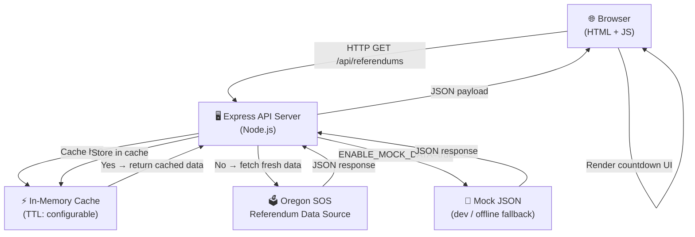
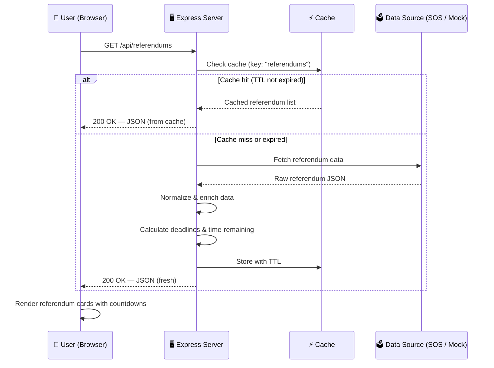
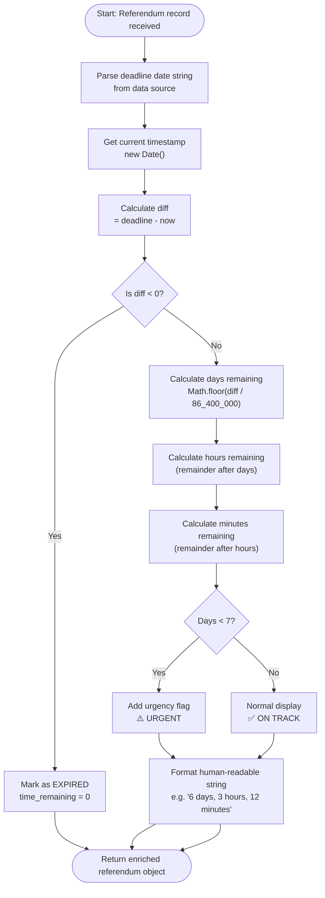
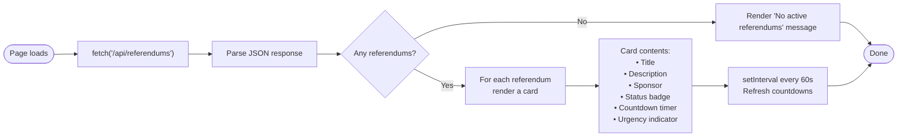
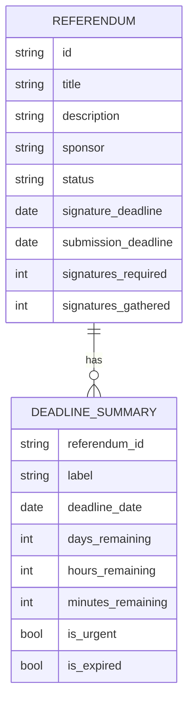
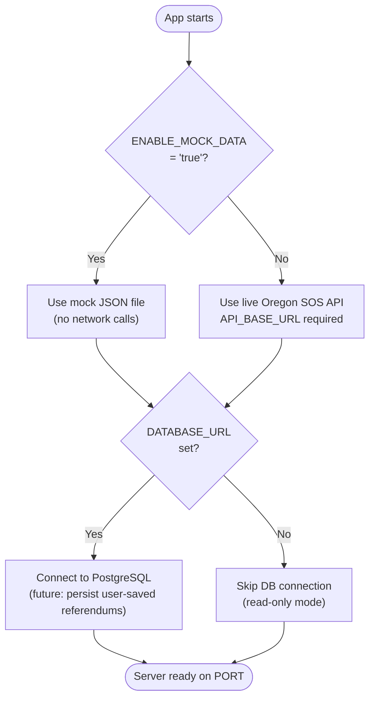

# Logic Flow — referendum-time

## Executive Summary

This document describes the end-to-end logic of the referendum-time application using a series of Mermaid diagrams. It covers the user request lifecycle, data-fetching strategy, deadline calculation logic, and the high-level component relationship diagram. These diagrams were produced as part of the post-build documentation sprint.

---

## 1. High-Level System Architecture

---

## 2. User Request Lifecycle

---

## 3. Deadline Calculation Logic

---

## 4. Frontend Render Flow

---

## 5. Data Model

---

## 6. Environment & Config Decision Tree

---

## Sources & References

| Source | URL |
|---|---|
| Mermaid diagram documentation | https://mermaid.js.org/intro/ |
| Mermaid flowchart syntax | https://mermaid.js.org/syntax/flowchart.html |
| Mermaid sequence diagram syntax | https://mermaid.js.org/syntax/sequenceDiagram.html |
| Mermaid ER diagram syntax | https://mermaid.js.org/syntax/entityRelationshipDiagram.html |
| GitHub Mermaid rendering | https://docs.github.com/en/get-started/writing-on-github/working-with-advanced-formatting/creating-diagrams |
| Oregon SOS — Ballot Measures | https://sos.oregon.gov/elections/Pages/ballot-initiatives.aspx |
